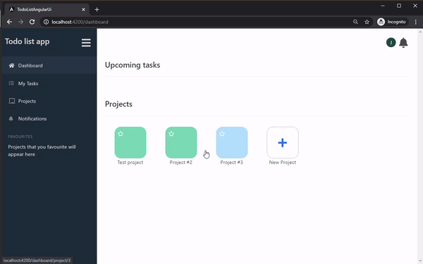

# Introduction

This is a small preview for a TODO list project that I am currently building. When completed, the project will consist of:

 * A web UI built in Angular
 * A mobile app built with React Native; and
 * An API written in .NET Core

For the API, please see: 

https://github.com/JakeM321/todo-list-backend

For the Angular UI, please see:

https://github.com/JakeM321/todo-list-angular-UI

The project currently demonstrates:

 * SSO and authentication with JWT
 * Secure password management
 * Pushing notifications and updates from server-to-client via SignalR

# Completed features

## SSO sign-up

Accounts can also be created with a username/password.

## Create projects and tasks

A project consists of a list of tasks and a list of members. When a task is created within a project, a member is assigned to it.

## Add other members to a project

Other users can be added to a project. A notification will be pushed to the user when they are added.

## Assign a task to another member

If you assign a task to another member, a notification will be pushed to alert them.

## Favourites

Projects can be added as personal favourites.